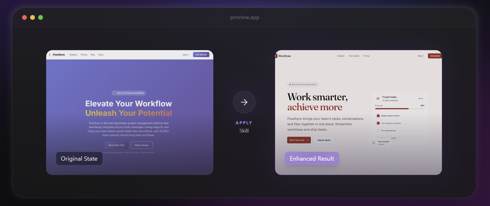

# Presto Design

`presto-design` is a root-level frontend design skill for agents that need stronger visual judgment, clearer design reasoning, and more disciplined implementation.

Current focus:

- style locking before code starts
- stronger typography, color, spacing, and surface language
- targeted redesign and refine workflows
- purposeful micro-interactions
- better icon selection with conservative fallbacks

This repository publishes a single installable skill at the repository root.

## What It Is

Presto Design is a route-driven design workflow.

It reads the task, loads one cluster, optionally applies one preset, then enforces a shared contract across the output. The goal is not just to make a UI look better. The goal is to make the design direction intentional, explainable, and compatible with the host project.

In practical terms, the skill tries to do five things:

- lock design decisions to audience, tone, and use case
- reduce generic AI-looking output patterns
- improve component quality without unnecessary rewrites
- treat motion as feedback and hierarchy, not decoration
- keep redesign work grounded in the existing stack

## Current Capability Model

The skill currently centers on five core abilities:

| Capability | Current state |
|-----------|---------------|
| Style locking | Strong. Uses audience, brand tone, use case, and three global parameters to steer output. |
| Aesthetic strengthening | Strong. Pushes harder on hierarchy, palette discipline, spacing rhythm, and anti-generic patterns. |
| Component discipline | Good. Improves surfaces, removes noise, tightens implementation, but is not a full design-system authoring framework. |
| Micro-interactions | Good. Covers timing, feedback, reduced-motion, and performance-safe motion constraints. |
| Icon selection | Useful but tooling-sensitive. Best with icon search tools; conservative fallback exists when they are unavailable. |

## How It Routes Work

The root skill loads exactly one cluster at a time:

- `create`: build a UI from scratch
- `refine`: improve a specific page or component without replacing the overall structure
- `redesign`: upgrade an existing project in place
- `motion`: add purposeful animation and transitions
- `fix`: audit and repair accessibility, UX, performance, metadata, and anti-pattern issues
- `overdrive`: push much harder when the user explicitly wants a more extreme visual result

It can then apply one aesthetic preset:

- `minimalist`
- `editorial`

This keeps execution narrow enough to stay coherent.

## Decision Model

Before implementation, the skill is supposed to answer three questions:

1. Why does this direction fit the audience and use case?
2. Why do the typography, color, layout, and motion choices fit the product?
3. Why is this level of change appropriate for the current codebase and design language?

That reasoning is now part of the contract, not an optional flourish.

## Global Parameters

The skill uses three global parameters to shape design decisions:

- `VARIANCE`: how restrained or experimental the composition should be
- `MOTION`: how quiet or expressive the interaction language should be
- `DENSITY`: how airy or information-dense the interface should be

Current calibration is rule-based, not example-based.

That means the parameters already have semantic ranges, but they do not yet ship with canonical screenshot or code anchors. Right now they work best as decision constraints, not as fully calibrated style tokens.

### Quick ranges

`VARIANCE`

- `1-3`: stable grid, low asymmetry, predictable rhythm
- `4-7`: selective asymmetry, stronger hierarchy contrast
- `8-10`: layered composition, stronger visual punctuation

`MOTION`

- `1-3`: hover and focus only, near-static UI
- `4-7`: entrances, stronger state feedback, restrained choreography
- `8-10`: motion-led emphasis, scroll-driven sequences, higher implementation cost

`DENSITY`

- `1-3`: editorial whitespace, fewer decisions on screen
- `4-7`: balanced product UI
- `8-10`: data-heavy, operational composition

## Escalation Policy

Presto Design does not assume that "taste-first" means "replace what exists."

The current policy is:

1. Preserve the host stack and working architecture.
2. Preserve the existing design language when it is coherent, branded, and competently implemented.
3. Escalate to a stronger visual reset only when the current language is generic, inconsistent, or actively hurting clarity or credibility.

Short version: respect the stack always, respect the current design language conditionally.

## Contract

All clusters are bound by [`contract.md`](./contract.md).

The contract currently does four jobs:

1. Requires design rationale before implementation
2. Treats common AI-looking patterns as warning signs, not timeless laws
3. Defines a change policy for taste-vs-continuity decisions
4. Sets a production baseline for implementation quality

This is the main mechanism that keeps the skill from collapsing into pure style-swapping.

## Production Baseline

"Production-minded" here means more than generating runnable code.

The current baseline includes:

- visible focus states
- keyboard-reachable interactions
- `prefers-reduced-motion` support when motion is introduced
- responsive behavior and minimum touch-target awareness
- semantic HTML where applicable
- Tailwind version awareness when Tailwind is present
- metadata hygiene on page-level work when relevant
- motion choices that stay inside reasonable performance bounds

This is a baseline, not a guarantee of full production readiness in every stack. Host-project requirements still win.

## Tooling and Fallbacks

Icon selection is strongest when the environment provides `better-icons` or an icon MCP server.

When those tools are not available, the current fallback is:

- inspect installed icon packages first
- stay within one existing icon family if it is acceptable
- prefer known package imports over hand-written SVG paths
- keep icon changes conservative when no dependable source exists

The skill should degrade gracefully rather than pretending external tooling is always present.

## Current Limits

The skill is useful, but its limits should be explicit:

- parameter calibration is not yet backed by canonical visual examples
- presets are still narrow in scope
- component discipline is stronger than component-system formalization
- icon quality depends partly on environment tooling
- this is a design workflow skill, not a benchmarked research artifact

## Repo Structure

```text
SKILL.md
agents/
clusters/
context/
presets/
contract.md
gsap-integration.md
tailwind-integration.md
```

## Install

Install directly from GitHub:

```powershell
npx skills add MapleCity1314/presto-design-skill
```

If the CLI supports explicit path selection, the root path is `/`.

## Example Prompts

```text
Redesign this dashboard to feel premium and calmer. Keep the existing React + Tailwind stack. The audience is finance operators who sit in it all day.
```

```text
Refine this settings panel. Keep the structure recognizable, but fix the typography, spacing rhythm, card treatment, and icon consistency.
```

```text
Build a landing page for a developer tool aimed at small engineering teams. Make it editorial, confident, and less startup-generic.
```

```text
Audit this UI for accessibility, motion performance, and generic AI-looking design patterns, then fix the highest-priority issues.
```

```text
Add micro-interactions to this app without making it flashy. Focus on hover, pressed, loading, and state-change feedback.
```
